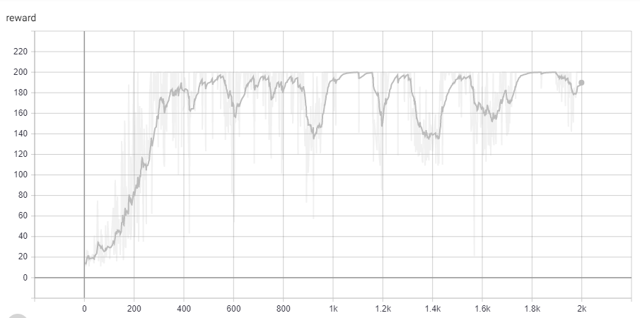

# 1. Introduction

This repository is used as the implementations of policy gradient algorithms. 

The reference link is [here](https://lilianweng.github.io/lil-log/2018/04/08/policy-gradient-algorithms.html)

# 2. Add game 2048 
CartPole is kind of easy to beat, thus add 2048 for some tests.

The api to use 2048 is `game.update(action)` in which action is UP(1), LEFT(2), DOWN(3), RIGHT(4).

To test, there already is a player who randomly selects action. run it with `python 2048_simplify.py`

# 3. Implementation

## 3.1. Monte Carlo Policy Gradient

For REINFORCE, following files are implemented
1. `Reinforce_CartPole.py`: Implement the REINFORCE for game `CartPole-v0`. 
1. `Baseline_CartPole.py`: Implement the baseline REINFORCE for game `CartPole-v0`.

The observation used in `CartPole-v0` is 4-dim observation (see [here](https://github.com/openai/gym/wiki/CartPole-v0)).

### 3.1.1. REINFORCE CartPole
To start the training, the simplest way is to run `python Reinforce_CartPole.py`

Type `python Reinforce_CartPole.py --help` to see other options of training.

For reference only, mine is `python Reinforce_CartPole.py -e 20000 -a [continuing/episodic] --info rein_cart`.

### 3.1.2. Add baseline to REINFORCE

To start the training, the simplest way is to run `python Baseline_CartPole.py`

Type `python Baseline_CartPole.py --help` to see other options of training.

For reference only, mine is `python Baseline_CartPole.py -e 20000 -a [continuing/episodic] --info base_cart`.

### 3.1.3. Result

* Red line: Baseline REINFORCE & Continuing Update
* Green line: Baseline REINFORCE & Episodic Update
* Blue line: REINFORCE & Continuing Update
* Orange line: REINFORCE & Episodic Update

### 3.1.4. Discussion

Basically, the only difference between REINFORCE and baseline REINFORCE is to subtract the mean value from discounted reward summation. However, with this minor modification, the result has a significant improvement. Another way of using baseline is to use another state-value function to estimate the baseline (see [here](http://incompleteideas.net/book/RLbook2018.pdf) Page 330) 

Considering the fact that the CartPole is a continuing tasks without the episodes, the result also shows that the when using episodic Update and continuing Update, the one trained with continuing Update strongly outperformed the other one.

BTW, the difference of episodic update and continuing update is

* Episodic: 

\nabla\ln\pi(A_t|S_t,\mathbf{\theta}))

* Continuing: 

\nabla\ln\pi(A_t|S_t,\mathbf{\theta}))

## 3.2. Actor-Critic

### 3.2.1. Training

To start the training, the simplest way is to run `python A2C_CartPole.py`

Type `python A2C_CartPole.py --help` to see other options of training.

For reference only, mine is `python A2C_CartPole.py -e 2000 --info ac_cart`.

### 3.2.2. Result

### 3.2.3. Discussion
* The Actor-Critic Algorithm is a "family of  related techniques which train some critic network that computes value estimate in order to plug into the update as a lower-variance replacement. Thus here the implementation is based on using estimates of advantage function A(s,a) as the "value", which is exactly Advantage Actor-Critic (A2C) does. 

* Significantly faster than REINFORCE, take around 400 epochs to get satifying result. In comparison, baseline reinforce takes 7k epochs.

* Have tried pixel value observation, still not working well.

## 3.3. A3C

Asynchronous Advantage Actor-Critic

### 3.3.1. Implementation

To start the training, the simplest way is to run `python A3C_CartPole.py`, remember go to the a3c folder.

Type `python A3C_CartPole.py --help` to see other options of training.

For reference only, mine is `python A3C_CartPole.py -e 1000 -l 0.0001`.

### 3.3.2. Result
Because there are multiple threads, each has its own update procedure. Thus no figure for global result. But in my machine, each thread started to converge when episode was about 350. 

### 3.3.3. Discussion
* The number of processes is set to 4 in default. It is true that with the increase of number of processes, agent tends to find optimal policy more quickly. I suppose there are two reasons. 1. More prcesses can explore more possibilities of policy. 2. More processes means during the same amount of episodes, the parameters of global network can be updated more times.

* I have not encounted problems like stucking into local optimal point. I would account this for the game itself is easy.

## 3.4. A2C

The implementation is in "Actor-Critic".

### 3.4.1. Discussion

* According to the training result, the A3C and A2C is almost the same to each other, specially when number of process is set to a moderate number like 4 or 5. Probably it is why [openai](https://openai.com/blog/baselines-acktr-a2c/) used A2C as their baseline rather than A3C. 

* The interpretation in [Lil'Log]((https://lilianweng.github.io/lil-log/2018/04/08/policy-gradient-algorithms.html)) is probably wrong as far as i think. Basically, the implementation of A2C given by [openai](https://github.com/openai/baselines/tree/master/baselines/a2c) shows no sign of using synchronized multiprocessing or any codes of coordinator. If i am wrong, please feel free to correct me. 

# 4. Reference
[Reinforce Learning Book](http://incompleteideas.net/book/RLbook2018.pdf)

[CS294 DRL UCB](http://rail.eecs.berkeley.edu/deeprlcourse-fa17/)

[Pytorch Tutorial](https://pytorch.org/tutorials/intermediate/reinforcement_q_learning.html) 